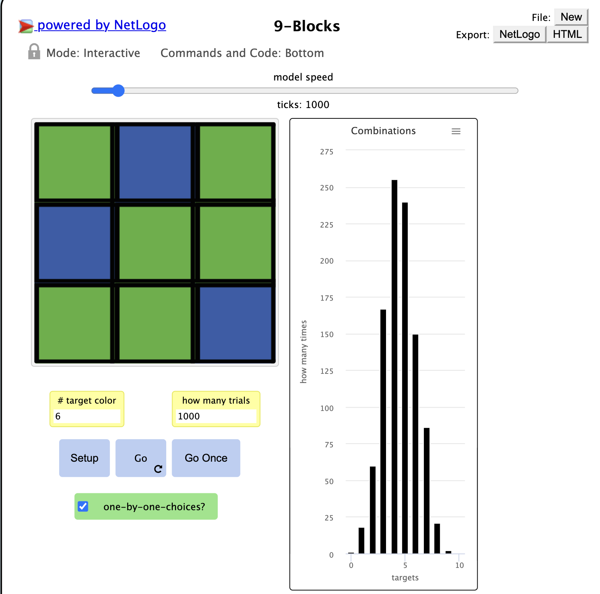
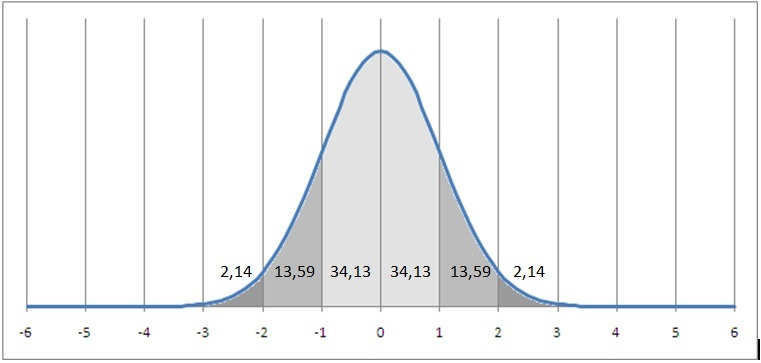

## Імітаційне моделювання комп'ютерних систем
## СПм-21-2, **Слабухо Данил Олегович**
### Лабораторная работа №**1**. Описание имитационных моделей

 

### Выбранная модель в среде NetLogo:
[9 Blocks](http://www.netlogoweb.org/launch#http://www.netlogoweb.org/assets/modelslib/Sample%20Models/Mathematics/Probability/ProbLab/Unverified/9-Blocks.nlogo)

 

### Вербальное описание модели:
9-Blocks имитирует вероятностный эксперимент, в котором случайным образом выпадают различные комбинации цветов девяти квадратов, каждый из которых может быть независимо зеленым или синим. Модель помогает нам понять отношения между теоретическими и практическими аспектами биномиальной функции: комбинаторным анализом (что мы можем получить) и экспериментированием (что мы действительно получаем).

### Управляющие параметры:
- **one-by-one-choices?** когда включено, каждый квадрат будет останавливаться на своем цвете в разное время. Также между 9-ю кварталами будет пауза, как будто на мгновение выключили свет. Это должно напомнить нам, что хотя мы смотрим на 9 блоков, на самом деле каждый квадрат выбирает свой цвет независимо от других квадратов.

### Внутренние параметры:

### Критерии эффективности системы:
- практическое распределние должно соответствовать теоретическому(комбинаторному) 

### Примечания:
При включенном режиме "one-by-one-choices" 
каждый квадрат будет останавливаться на своем цвете в разное время. Также между 9-ю кварталами будет пауза, как будто на мгновение выключили свет. 
Это должно напомнить нам, что хотя мы смотрим на 9 блоков, на самом деле каждый квадрат выбирает свой цвет независимо от других квадратов.

### Недостатки модели:
Невозможно изменить вероятность выпадения цвета

 

## Вычислительные эксперименты

### 1. Анализ распределения результатов 

Проведем 5 эксперементов по 1000 шагов каждый.

<table>
<thead>
<tr><th>Номер эксперимента</th><th>Количество зеленх квадратов 0-1-2-3-4-5-6-7-8-9</th></tr>
</thead>
<tbody>
<tr><td>1</td><td>1-18-70-167-255-240-150-76-21-2</td></tr>
<tr><td>2</td><td>3-20-72-158-249-254-156-69-18-1</td></tr>
<tr><td>3</td><td>1-23-67-160-260-247-143-76-20-3</td></tr>
<tr><td>4</td><td>2-17-79-143-256-247-169-67-18-2</td></tr>
<tr><td>5</td><td>1-22-63-140-245-257-175-75-20-2</td></tr>
</tbody>
</table>

Посчитаем среднее арифмитическое каждого случая. 

<table>
<thead>
<tr><th>Количество зеленых квадратов </th><th>Среднее арифметическое</th></tr>
</thead>
<tbody>
<tr><td>0</td><td>1,6</td></tr>
<tr><td>1</td><td>20</td></tr>
<tr><td>2</td><td>70,2</td></tr>
<tr><td>3</td><td>153,6</td></tr>
<tr><td>4</td><td>253</td></tr>
<tr><td>5</td><td>249</td></tr>
<tr><td>6</td><td>158,6</td></tr>
<tr><td>7</td><td>72,6</td></tr>
<tr><td>8</td><td>19,4</td></tr>
<tr><td>9</td><td>2</td></tr>
</tbody>
</table>

Результат: Когда вероятность получения зеленого квадрата установлена на уровне 50%, 
возникающее эмпирическое распределение будет динамически сходиться к нормальному распределению 

Эксперимент наглядно показывае распределения, тем самым подтверждая комбинаторный анализ.
